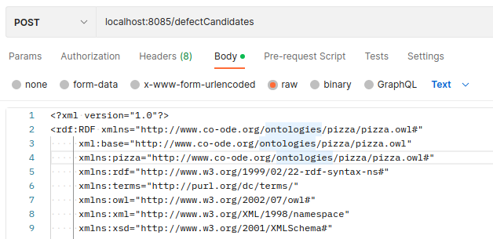

# Ontology Defect Heuristics

This project is a REST service to check ontologies for possible defects using heuristics. For more information on the implemented heuristics see the [master thesis by Alexander Prock](https://repositum.tuwien.at/handle/20.500.12708/18436).

It is written in Kotlin and uses Spring Boot. [OWL API](https://github.com/owlcs/owlapi/wiki) is used for handling ontologies, reasoning is performed using the HermiT reasoner.

Note: As this is a demo project no special effort was made to graciously handle errors, every problem will result in a response with error code 500.

## Prerequisites

- Java 17
- Maven

## Build

```
mvn clean install
```

## Run

```
mvn spring-boot:run
```

## Usage

This service runs on port 8085 by default (can be adapted in `application.yml`). 
It exposes one endpoint: `POST /defectCandidates`, accepting an ontology as the request body in plain text.
The ontology is parsed using OWL API, all common OWL serialization formats should be supported.

## Usage Example

This example uses the pizza ontology downloaded from https://github.com/owlcs/pizza-ontology.

Send a request using `curl` and parse the response using `jq`:
```
curl -X POST http://localhost:8085/defectCandidates \
    --header 'Content-Type: text/plain' \
    --data-binary "@./pizza.owl" | jq
```
Note: The relative path to the ontology file must be adapted accordingly.

Any other REST client will work too, e.g. see the same request using Postman:



Depending on the ontology size, complexity and hardware resources, the response may take some time.

The result should look like this - in total 4 defect candidates (1 missing closure, 1 missing disjointness, 2 trivially satisfiable allValuesForm, no unsatisfiable intersections) are found.
```
[
    {
        "name": "missing-closure",
        "candidates": [
            {
                "classes": [
                    {
                        "label": "UnclosedPizza",
                        "renderedAxioms": [
                            "UnclosedPizza SubClassOf hasTopping some MozzarellaTopping",
                            "UnclosedPizza SubClassOf Pizza",
                            "UnclosedPizza DisjointWith (each of) American"
                        ],
                        "context": [
                            "An unclosed Pizza cannot be inferred to be either a VegetarianPizza or a NonVegetarianPizza, because it might have other toppings."
                        ]
                    }
                ]
            }
        ]
    },
    {
        "name": "missing-disjointness",
        "candidates": [
            {
                "classes": [
                    {
                        "label": "NamedPizza",
                        "renderedAxioms": [
                            "NamedPizza SubClassOf Pizza"
                        ],
                        "context": [
                            "A pizza that can be found on a pizza menu"
                        ]
                    },
                    {
                        "label": "UnclosedPizza",
                        "renderedAxioms": [
                            "UnclosedPizza SubClassOf hasTopping some MozzarellaTopping",
                            "UnclosedPizza SubClassOf Pizza",
                            "UnclosedPizza DisjointWith (each of) American"
                        ],
                        "context": [
                            "An unclosed Pizza cannot be inferred to be either a VegetarianPizza or a NonVegetarianPizza, because it might have other toppings."
                        ]
                    }
                ]
            }
        ]
    },
    {
        "name": "trivially-satisfiable-allValuesFrom",
        "candidates": [
            {
                "classes": [
                    {
                        "label": "VegetarianPizzaEquivalent2",
                        "renderedAxioms": [
                            "VegetarianPizzaEquivalent2 EquivalentTo Pizza and (hasTopping only (CheeseTopping or FruitTopping or HerbSpiceTopping or NutTopping or SauceTopping or VegetableTopping))"
                        ],
                        "context": [
                            "An alternative to VegetarianPizzaEquiv1 that does not require a definition of VegetarianTopping. Perhaps more difficult to maintain. Not equivalent to VegetarianPizza"
                        ]
                    }
                ]
            },
            {
                "classes": [
                    {
                        "label": "VegetarianPizzaEquivalent1",
                        "renderedAxioms": [
                            "VegetarianPizzaEquivalent1 EquivalentTo Pizza and (hasTopping only VegetarianTopping)"
                        ],
                        "context": [
                            "Any pizza that only has vegetarian toppings or no toppings is a VegetarianPizzaEquiv1. Should be inferred to be equivalent to VegetarianPizzaEquiv2.  Not equivalent to VegetarianPizza because PizzaTopping is not covering"
                        ]
                    }
                ]
            }
        ]
    },
    {
        "name": "unsatisfiable-intersections",
        "candidates": []
    }
]
```

## License

MIT

## Contact

Semantics Systems Group @ WU (https://semantic-systems.org/contact/)